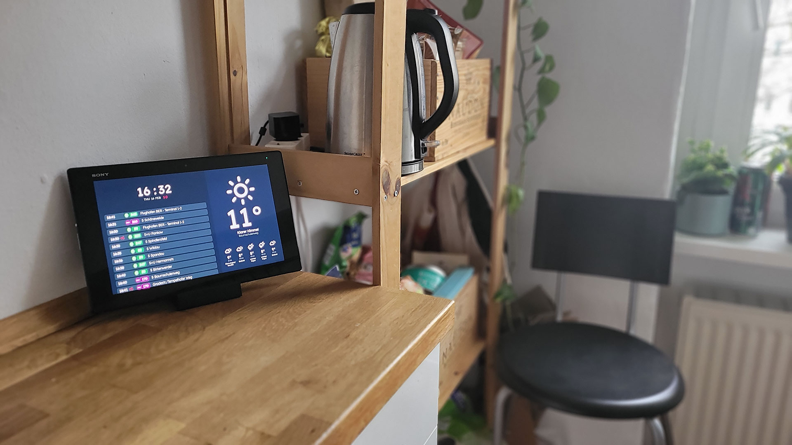
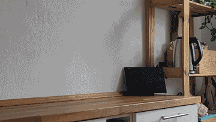

# Behring5 Dashboard

A fullscreen info dashboard (re)built with React, designed to run on a tablet in my kitchen. <br>
I'm using the [Fully Kiosk Browser](https://www.fully-kiosk.com/) othe tablet, which has some nice features like fullscreen mode and motion/sound detection, which turns the screen on when you enter the kitchen.
<br><br>



## Features

- **Time** — live clock display
- **Weather** — current conditions and hourly forecast, updated every 10 minutes, data fetched from my little personal weather API weather.behring5.de (its basically cached data from [openweathermap.org](https://openweathermap.org) )
- **Transportation** — real-time BVG departure board for Baumschulenweg, updated every 30 seconds, data fetched from https://v6.bvg.transport.rest/

## Dev

```bash
npm install
npm run dev
```
